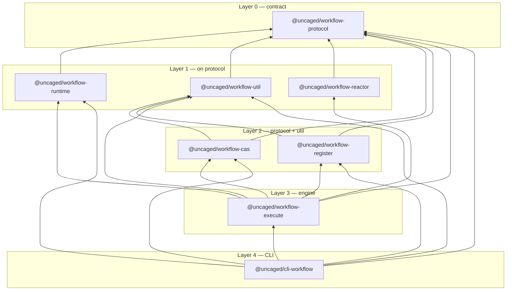

# Uncaged workflow — Architecture

**Last updated:** 2026-05-09

---

## Overview

A workflow engine that executes single-file ESM bundles. Each workflow is a self-contained `.esm.js` file identified by its XXH64 hash (Crockford Base32). No daemon — processes start on demand and exit when done.

The implementation lives in **15** Bun workspace packages under `packages/`, using the `workspace:*` protocol.

## Package map

Grouped by responsibility (npm name → folder).

| Layer | Package | One-line role |
|-------|---------|----------------|
| Contract | `@uncaged/workflow-protocol` → `workflow-protocol` | Shared TypeScript types and `Result` helpers; peer `zod` only — no other workspace deps. |
| Author API | `@uncaged/workflow-runtime` → `workflow-runtime` | `createWorkflow` and re-exports of protocol workflow types for bundle authors. |
| Shared infra | `@uncaged/workflow-util` → `workflow-util` | Base32/ULID, logger, storage root paths, global CAS dir, ref-field helpers. |
| LLM plumbing | `@uncaged/workflow-reactor` → `workflow-reactor` | `createLlmFn`, `createThreadReactor`, and related tool-call types for threaded LLM invocation. |
| CAS | `@uncaged/workflow-cas` → `workflow-cas` | `CasStore` implementation, XXH64 hashing, Merkle helpers over CAS payloads. |
| Registry / bundles | `@uncaged/workflow-register` → `workflow-register` | Bundle validation & dynamic export extraction, `workflow.yaml` registry I/O, provider/model resolution. |
| Engine | `@uncaged/workflow-execute` → `workflow-execute` | Thread execution, worker entry path, fork/GC, extract pipeline, `workflowAsAgent`. |
| CLI | `@uncaged/cli-workflow` → `cli-workflow` | `uncaged-workflow` binary (depends on engine, registry, CAS, protocol, util, runtime). |
| Agent adapters | `@uncaged/workflow-agent-cursor` → `workflow-agent-cursor` | `AgentFn` via `cursor-agent` CLI + workspace extraction. |
| | `@uncaged/workflow-agent-hermes` → `workflow-agent-hermes` | `AgentFn` via `hermes chat` CLI. |
| | `@uncaged/workflow-agent-llm` → `workflow-agent-llm` | `AgentFn` via OpenAI-compatible HTTP (`LlmProvider` from runtime). |
| Agent shared | `@uncaged/workflow-util-agent` → `workflow-util-agent` | `buildAgentPrompt`, `spawnCli` for CLI-backed agents. |
| Templates | `@uncaged/workflow-template-develop` → `workflow-template-develop` | Develop workflow definition, roles, descriptor builder. |
| | `@uncaged/workflow-template-solve-issue` → `workflow-template-solve-issue` | Solve-issue workflow definition, roles, descriptor builder. |
| Dashboard | `@uncaged/workflow-dashboard` → `workflow-dashboard` | Private Vite + React app (`src/main.tsx`); only `react` / `react-dom` dependencies — no workspace packages. |

## Dependency graph (workspace packages)

Bottom-up layering for the execution stack:



**Adjacent consumers** (not in the main CLI stack):

- `@uncaged/workflow-util-agent` → `@uncaged/workflow-runtime`
- `@uncaged/workflow-agent-llm` → `@uncaged/workflow-runtime`
- `@uncaged/workflow-agent-cursor` → `@uncaged/workflow-runtime`, `@uncaged/workflow-util-agent`, `zod`
- `@uncaged/workflow-agent-hermes` → `@uncaged/workflow-runtime`, `@uncaged/workflow-util-agent`
- `@uncaged/workflow-template-develop` → `@uncaged/workflow-register`, `@uncaged/workflow-runtime`, `zod`
- `@uncaged/workflow-template-solve-issue` → `@uncaged/workflow-register`, `@uncaged/workflow-runtime`, `zod` (dev-only workspace deps: `@uncaged/workflow-cas`, `@uncaged/workflow-execute` for tests/tooling per `package.json`)

## Package roles (detail)

- **`workflow-protocol`** — Pure types (`WorkflowFn`, contexts, `CasStore` interface, descriptor shapes), `START` / `END`, `ok` / `err`. Depends only on peer `zod` for schema-related types in signatures.
- **`workflow-runtime`** — Workflow author surface: `createWorkflow` from `src/create-workflow.js`, re-exports protocol types/constants used when authoring bundles.
- **`workflow-util`** — Cross-cutting utilities: Crockford Base32, ULID, `createLogger`, `getDefaultWorkflowStorageRoot`, `getGlobalCasDir`, ref normalization; re-exports `ok`/`err` from protocol.
- **`workflow-cas`** — Filesystem CAS (`createCasStore`), `hashString` / `hashWorkflowBundleBytes`, Merkle node serialization and helpers (`merkle.js`).
- **`workflow-register`** — Bundle pipeline (`validateWorkflowBundle`, `extractBundleExports`, descriptor builders), registry YAML read/write, `resolveModel` / `splitProviderModelRef`.
- **`workflow-execute`** — `executeThread`, supervisor/worker wiring (`engine/`), fork/GC/pause gate, `createExtract` + LLM extract helpers (`extract/`), `workflowAsAgent`. Imports `@uncaged/workflow-reactor` for LLM-backed extract/supervisor paths (`extract-fn.ts`, `supervisor.ts`).
- **`workflow-reactor`** — `createLlmFn`, `createThreadReactor`, and thread tool-invocation types — consumed by `workflow-execute`.
- **`cli-workflow`** — CLI commands and HTTP/dashboard-related wiring (`hono`, `yaml`); composes register + execute + CAS + util.
- **`workflow-agent-*`** — Replaceable `AgentFn` implementations (Cursor / Hermes CLIs, or HTTP LLM).
- **`workflow-util-agent`** — Shared prompt assembly and subprocess spawning for CLI agents.
- **`workflow-template-*`** — Concrete `WorkflowDefinition` graphs + Zod role schemas + descriptor builders for publishing bundles.
- **`workflow-dashboard`** — Standalone React UI; no published library entry matching `src/index.ts`.

## Three-phase engine loop

Each role round is implemented in `packages/workflow-runtime/src/create-workflow.ts` (`advanceOneRound`): moderator → agent → extractor, with progressive context types from `@uncaged/workflow-protocol`.

```
┌─→ Phase 1: MODERATOR
│   Context: ModeratorContext { threadId, depth, start, steps }
│   Action:  moderator(ctx) → role name | END
│
│   Phase 2: AGENT
│   Context: AgentContext = ModeratorCtx + { currentRole: { name, systemPrompt } }
│   Action:  agent(ctx) → raw string
│
│   Phase 3: EXTRACTOR
│   Context: ExtractContext = AgentCtx + { agentContent }
│   Action:  runtime.extract(schema, extractPrompt, ctx) → typed meta
│
│   Merge: RoleStep { role, contentHash, meta, refs, timestamp }
│   Append to steps
└─────────────────────────────────────────────────────┘
```

### Context types (progressive)

Defined in `packages/workflow-protocol/src/types.ts`:

```typescript
type ModeratorContext<M> = ThreadContext<M>;
type AgentContext<M> = ModeratorContext<M> & {
  currentRole: { name: string; systemPrompt: string };
};
type ExtractContext<M> = AgentContext<M> & { agentContent: string };
```

### Key properties

- **Moderator is synchronous and pure** — no I/O, no state mutation inside `createWorkflow`’s moderator call path.
- **Agent receives `AgentContext`** — reads `ctx.currentRole.systemPrompt`; raw output becomes `agentContent` for extract.
- **Extractor is `WorkflowRuntime.extract`** — supplied by the engine from registry-resolved LLM config (`workflow-execute`); stores agent body in CAS and yields `contentHash` + `refs` on each step (`create-workflow.ts`).
- **`extractPrompt` is a call parameter** on `RoleDefinition`, not implicit context state.

## Agent information sources

An agent has exactly three information sources:

1. **Prior knowledge** — LLM training, agent memory, agent skills
2. **Thread context** — `AgentContext` (`start`, `steps`, `currentRole`)
3. **Derived information** — from 1 & 2 (e.g. tool calls, shell commands)

No hidden environment parameters. If an agent needs something (like a workspace path), it obtains it via `ExtractFn` (e.g. Cursor agent).

## Bundle contract

A workflow bundle is a single `.esm.js` file with two named exports (see `WorkflowFn` / `WorkflowDescriptor` in `packages/workflow-protocol/src/types.ts`):

```typescript
export const descriptor: WorkflowDescriptor;
export const run: WorkflowFn;

type WorkflowFn = (
  thread: ThreadContext,
  runtime: WorkflowRuntime,
) => AsyncGenerator<RoleOutput, WorkflowCompletion>;
```

`RoleOutput` carries `contentHash`, `meta`, and `refs` (agent text lives in CAS, addressed by hash).

### Constraints

- Single `.esm.js` file
- No dynamic `import()` in bundles (loader exempt in engine)
- Portable bundle static imports are constrained by validation in `@uncaged/workflow-register` (`validateWorkflowBundle`)
- XXH64 hash (Crockford Base32) = version ID

### Why AsyncGenerator?

- Each `yield` lets `workflow-execute` persist state, CAS rows, and enforce pause/abort
- `return` supplies `WorkflowCompletion`
- Fork replays historical steps into a new thread context
- Bundle does not import the engine — only protocol/runtime types at build time

## Storage layout

```
~/.uncaged/workflow/
├── cas/                           # Global content-addressed blobs (see getGlobalCasDir)
├── bundles/
│   ├── C9NMV6V2TQT81.esm.js       # Crockford Base32 of XXH64
│   ├── C9NMV6V2TQT81.yaml         # Role descriptor sidecar (when present)
│   └── C9NMV6V2TQT81/             # Per-hash bundle dir (alongside or instead of loose files)
│       ├── threads.json           # Active threads: threadId → { head, start, updatedAt }
│       └── history/
│           └── 2026-05-09.jsonl   # Completed threads (one JSON object per line)
├── logs/                          # One folder per bundle hash
│   └── C9NMV6V2TQT81/
│       ├── 01KQXKW…YG.running     # Present while worker executes this thread (optional)
│       └── 01KQXKW…YG.info.jsonl   # Debug log
└── workflow.yaml                  # Registry
```

### ID encoding: Crockford Base32

- Case-insensitive, filesystem-safe, no ambiguous chars (0/O, 1/I/L)
- Bundle hash: XXH64 → 13-char
- Thread ID: ULID → 26-char (10 timestamp + 16 random)

### Registry (`workflow.yaml`)

Managed by `@uncaged/workflow-register` (`readWorkflowRegistry`, `writeWorkflowRegistry`, …). Shape includes workflow entries and a top-level `config` section used for extract/supervisor model resolution.

### Thread storage (CAS + index)

Thread execution state is a chain of immutable CAS nodes (`StartNode`, `StateNode`, content Merkle blobs). Per bundle:

- **`threads.json`** — only in-flight threads (`head`, `start`, `updatedAt`).
- **`history/{YYYY-MM-DD}.jsonl`** — completed threads (`threadId`, `head`, `start`, `completedAt`).
- **CAS (`cas/`)** — payloads and refs for replay, GC, and fork sharing.

**`.info.jsonl`** — Structured debug log via `@uncaged/workflow-util` `createLogger`:

```jsonc
{ "tag": "4KNMR2PX", "content": "Loading bundle...", "timestamp": ... }
```

Tags are 8-char Crockford Base32 (40-bit random), one per call site. `grep "4KNMR2PX"` → code location.

## Execution model

- **No daemon.** `uncaged-workflow run <name>` starts a worker process (`workflow-execute` worker entry via `getWorkerHostScriptPath`)
- Threads share bundle-scoped workers as implemented in CLI/engine
- Pause/resume/abort via engine IPC and pause gate (`createThreadPauseGate`)

## CLI commands

| Priority | Command | Description |
|----------|---------|-------------|
| P1 | `add <name> <file.esm.js>` | Register a bundle |
| P1 | `list` | List registered workflows |
| P1 | `show <name>` | Show workflow details |
| P1 | `remove <name>` | Remove a workflow |
| P1 | `run <name> [--prompt] [--max-rounds]` | Start a thread |
| P1 | `threads [name]` | List threads |
| P1 | `thread <id>` | Show thread state |
| P1 | `thread rm <id>` | Delete a thread |
| P1 | `ps` | List running threads |
| P1 | `kill <thread-id>` | Terminate a running thread |
| P2 | `history <name>` | Show version history |
| P2 | `rollback <name> [hash]` | Switch to a previous version |
| P2 | `pause <thread-id>` | Pause a running thread |
| P2 | `resume <thread-id>` | Resume a paused thread |
| P3 | `fork <thread-id> [--from-role <role>]` | Fork from historical state |

## Design decisions

| Decision | Rationale |
|----------|-----------|
| **Role = pure data** | Decouples definition from execution; same role with different agents |
| **Agent bound at runtime** | `WorkflowDefinition` is reusable; agent choice is deployment concern |
| **Three-phase context** | Each phase sees only what it needs; types live in `workflow-protocol` |
| **`WorkflowRuntime.extract` + CAS `contentHash`** | Large agent bodies deduplicated globally; Merkle roots summarize threads |
| **`workflow-reactor` split** | LLM tool-calling loop isolated from filesystem/registry concerns |
| **Single-file ESM** | Hash = version, self-contained bundle |
| **No daemon** | OS handles process lifecycle |
| **Crockford Base32** | Filesystem-safe, readable, compact |
| **15-package split** | Clear boundaries: protocol ↔ runtime author API ↔ util/CAS/register ↔ execute ↔ CLI ↔ agents/templates/UI |
