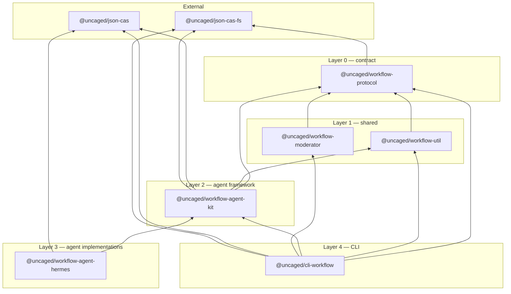

# Workflow Engine — Architecture

**Last updated:** 2026-05-19

---

## Overview

A stateless workflow engine driven by a single-step CLI. Workflows are YAML definitions stored as CAS nodes; threads are immutable chains of CAS-linked step nodes. No daemon — each `uwf thread step` invocation runs one moderator→agent→extract cycle and exits.

The implementation lives in **6** active packages under `packages/`, plus two external CAS packages (`@uncaged/json-cas`, `@uncaged/json-cas-fs`). Legacy packages reside in `legacy-packages/` and are not part of the active stack.

## Package map

| Layer | Package | One-line role |
|-------|---------|---------------|
| Contract | `@uncaged/workflow-protocol` → `workflow-protocol` | Shared TypeScript types (`WorkflowPayload`, `StepNodePayload`, `ModeratorContext`, `WorkflowConfig`, etc.). No runtime deps beyond `@uncaged/json-cas-fs`. |
| Shared infra | `@uncaged/workflow-util` → `workflow-util` | Crockford Base32, ULID generation, `createLogger`, frontmatter parsing/validation. |
| Moderator | `@uncaged/workflow-moderator` → `workflow-moderator` | Status-based graph evaluator: given a routing graph, last role, and last output, returns the next role or `$END`. |
| Agent framework | `@uncaged/workflow-agent-kit` → `workflow-agent-kit` | `createAgent` entrypoint factory, context builder, frontmatter fast-path extractor, LLM extract fallback, output format instruction builder. |
| Agent: Hermes | `@uncaged/workflow-agent-hermes` → `workflow-agent-hermes` | `uwf-hermes` CLI binary — spawns `hermes chat`, pipes prompt, captures session detail. |
| CLI | `@uncaged/cli-workflow` → `cli-workflow` | `uwf` binary — thread lifecycle, workflow registry, CAS inspection, setup. |

### External dependencies

| Package | Role |
|---------|------|
| `@uncaged/json-cas` | Content-addressed store API, XXH64 hashing, JSON Schema registration and validation. |
| `@uncaged/json-cas-fs` | Filesystem backend for `json-cas`. |
| `mustache` | Template renderer for edge prompts (used by `workflow-moderator`). |
| `commander` | CLI argument parsing (used by `cli-workflow`). |
| `dotenv` | Loads `.env` files for API keys. |
| `yaml` | YAML parse/stringify. |

## Dependency graph



## Workflow definition

Workflows are **YAML files** (not ESM bundles). `uwf workflow put <file.yaml>` parses the YAML, registers output schemas as JSON Schema CAS nodes, and stores the `WorkflowPayload` as a CAS node.

Example (`examples/solve-issue.yaml`):

```yaml
name: "solve-issue"
description: "End-to-end issue resolution"
roles:
  planner:
    description: "Creates implementation plan"
    goal: "You are a planning agent. Analyze the issue and create a step-by-step plan."
    capabilities:
      - issue-analysis
      - planning
    procedure: "Analyze the issue and create a detailed, actionable implementation plan."
    output: "Output the plan summary and list of concrete steps."
    meta:
      type: object
      properties:
        plan: { type: string }
        steps: { type: array, items: { type: string } }
      required: [plan, steps]
  developer:
    description: "Implements code changes"
    goal: "You are a developer agent. Implement the plan."
    capabilities:
      - file-edit
      - shell
    procedure: "Implement the plan. Write code, tests, and ensure existing tests pass."
    output: "List all files changed and provide a summary of the implementation."
    meta:
      type: object
      properties:
        filesChanged: { type: array, items: { type: string } }
        summary: { type: string }
      required: [filesChanged, summary]
  reviewer:
    description: "Reviews code changes"
    goal: "You are a code reviewer. Review the implementation."
    capabilities:
      - code-review
    procedure: "Review the implementation against the plan."
    output: "Approve or reject with detailed comments."
    meta:
      type: object
      properties:
        approved: { type: boolean }
        comments: { type: string }
      required: [approved, comments]
conditions:
  notApproved:
    description: "Reviewer rejected the implementation"
    expression: "steps[-1].output.approved = false"
graph:
  $START:
    - role: "planner"
      condition: null
  planner:
    - role: "developer"
      condition: null
  developer:
    - role: "reviewer"
      condition: null
  reviewer:
    - role: "developer"
      condition: "notApproved"
    - role: "$END"
      condition: null
```

Key properties:

- **`roles`** — inline role definitions; each `meta` is a JSON Schema (stored as its own CAS node on registration)
- **`graph`** — `Record<Role | "$START", Record<Status, Target>>` — status-based routing; each role maps statuses to targets
- **No agent binding** — agent selection is a deployment concern, configured in `config.yaml`
- **No Zod** — all schemas are JSON Schema, validated through `@uncaged/json-cas`

## Three-phase engine loop

Each `uwf thread step` runs exactly one cycle: moderator → agent → extract. The CLI orchestrates this in `packages/cli-workflow/src/commands/thread.ts` (`cmdThreadStep`).

```
┌─→ Phase 1: MODERATOR
│   Input:  graph + lastRole + lastOutput
│   Engine: Status-based map lookup against lastOutput.status
│   Output: next role name | $END
│
│   Phase 2: AGENT
│   Input:  thread-id + role (via argv)
│   Engine: agent-kit builds context from CAS chain, prepends
│           output format instruction to system prompt, spawns agent
│   Output: raw string (frontmatter markdown)
│
│   Phase 3: EXTRACT
│   Input:  raw agent output + role's meta schema
│   Engine: two-layer extract (frontmatter fast path → LLM fallback)
│   Output: CasRef to structured output node
│
│   Persist: StepNode { start, prev, role, output, detail, agent }
│   Update:  threads.yaml head pointer
└─────────────────────────────────────────────────────────────────┘
```

### Context types

Defined in `packages/workflow-protocol/src/types.ts`:

```typescript
type StepContext = {
  role: string;
  output: unknown;    // CAS node payload, expanded (not hash)
  detail: CasRef;
  agent: string;
};

type ModeratorContext = {
  start: StartNodePayload;  // { workflow: CasRef, prompt: string }
  steps: StepContext[];     // chronological, oldest first
};

type AgentContext = ModeratorContext & {
  threadId: ThreadId;
  role: string;
  store: Store;
  workflow: WorkflowPayload;
  outputFormatInstruction: string;
};
```

### Key properties

- **Moderator** — pure status-based map lookup; no LLM call, no I/O beyond CAS reads. Looks up `graph[lastRole][lastOutput.status]` to get the next target.
- **Agent** — receives `AgentContext` with thread history + role system prompt + output format instruction. Raw output is frontmatter markdown.
- **Extractor** — two-layer: tries frontmatter fast-path first (zero LLM cost), falls back to LLM extract if frontmatter is absent or invalid.
- **Stateless** — each `uwf thread step` is an atomic, self-contained operation. No in-memory state between steps.

## Agent CLI protocol

Each agent is an external command invoked by `uwf thread step`:

```bash
<agent-cmd> <thread-id> <role>
```

Contract:
1. `uwf thread step` determines the next role via the moderator
2. Agent CLI is spawned with `(thread-id, role)` as positional args
3. `workflow-agent-kit` (`createAgent`) handles the boilerplate:
   - Parses argv
   - Loads `.env` from storage root
   - Builds `AgentContext` by walking the CAS chain from `threads.yaml` head
   - Resolves the role's `meta` schema and builds `outputFormatInstruction`
   - Calls the agent's `run` function
   - Runs two-layer extract on the raw output
   - Writes `StepNode` to CAS (output + detail + prev link)
   - Prints the new `StepNode` CAS hash to stdout
4. `uwf thread step` reads stdout, updates `threads.yaml` head pointer, re-evaluates moderator for `done`
5. Exit 0 = success, non-zero = failure

Agent resolution priority: `--agent` CLI override → `config.yaml` per-workflow/role override → `config.yaml` `defaultAgent`.

## Agent output format: frontmatter markdown (RFC #351)

Agents produce **frontmatter markdown** — YAML frontmatter for structured meta, followed by a markdown body for content:

```markdown
---
status: done
next: reviewer
confidence: 0.9
artifacts:
  - src/auth.ts
scope: role
---

## Implementation

Fixed the login redirect by updating the auth middleware...
```

The `outputFormatInstruction` (built by `buildOutputFormatInstruction` in `workflow-agent-kit`) is prepended to the role's system prompt, so the deliverable format is the first thing the agent sees. It lists the expected frontmatter fields derived from the role's `meta` JSON Schema.

## Two-layer extract

Structured output extraction uses a two-layer strategy (`workflow-agent-kit`):

### Layer 1: frontmatter fast path (`frontmatter.ts`)

1. Parse YAML frontmatter from raw agent output (`parseFrontmatterMarkdown`)
2. Validate required fields (`validateFrontmatter`)
3. Build a candidate object from frontmatter fields (`status`, `next`, `confidence`, `artifacts`, `scope`)
4. `store.put()` the candidate against the role's `meta` schema
5. Validate with `json-cas` schema validation
6. If valid → return `outputHash` (zero LLM cost)

### Layer 2: LLM extract fallback (`extract.ts`)

If the fast path returns `null` (no frontmatter, invalid, or doesn't satisfy schema):

1. Resolve extract model alias from config (`modelOverrides.extract` → `models.extract` → `defaultModel`)
2. Call OpenAI-compatible chat completion with JSON mode
3. System prompt: "Extract structured data matching this JSON Schema: ..."
4. User message: the raw agent output
5. Parse response, `store.put()`, validate
6. Return `outputHash`

## Prompt injection

`workflow-agent-kit` prepends two pieces of context to the agent's system prompt:

1. **Deliverable format instruction** — generated from the role's `meta` schema, tells the agent exactly what frontmatter fields to produce and the expected format
2. **Scope constraint** — "Focus exclusively on YOUR role's deliverable. Do not perform actions outside your role's scope."

This ensures agents produce parseable frontmatter output without requiring per-agent format knowledge.

## CAS node types

### Workflow

```yaml
type: <workflow-schema-hash>
payload:
  name: "solve-issue"
  description: "End-to-end issue resolution"
  roles:
    planner:
      description: "Creates implementation plan"
      goal: "You are a planning agent..."
      capabilities: [planning, issue-analysis]
      procedure: "Analyze the issue and create a plan."
      output: "Output the plan summary."
      meta: "5GWKR8TN1V3JA"    # cas_ref → JSON Schema node
  conditions:
    notApproved:
      description: "Reviewer rejected"
      expression: "steps[-1].output.approved = false"
  graph:
    $START:
      - role: "planner"
        condition: null
```

### StartNode

```yaml
type: <start-node-schema-hash>
payload:
  workflow: "4KNM2PXR3B1QW"    # cas_ref → Workflow
  prompt: "Fix the login bug..."
```

### StepNode

```yaml
type: <step-node-schema-hash>
payload:
  start: "4TNVW8KR2B3MA"      # cas_ref → StartNode
  prev: "2MXBG6PN4A8JR"       # cas_ref → previous StepNode (null for first step)
  role: "developer"
  output: "9KRVW3TN5F1QA"     # cas_ref → structured output (validated against meta schema)
  detail: "7BQST3VW9F2MA"     # cas_ref → execution detail (raw turns, session data)
  agent: "uwf-hermes"         # agent command used (plain string)
```

### Chain structure

```
threads.yaml: { "01J7K9...4T": "8FWKR3TN5V1QA" }
                                    │
                                    ▼
                            StepNode (step 3)
                            ├── start ──→ StartNode
                            │              ├── workflow → Workflow (CAS)
                            │              └── prompt: "Fix..."
                            ├── prev ──→ StepNode (step 2)
                            │             ├── prev ──→ StepNode (step 1)
                            │             │             └── prev: null
                            │             └── ...
                            ├── role: "reviewer"
                            ├── output → CAS({ approved: true })
                            ├── detail → CAS(session turns)
                            └── agent: "uwf-hermes"
```

## Storage layout

```
~/.uncaged/workflow/
├── cas/                          # json-cas filesystem store (all CAS nodes)
├── config.yaml                   # Provider, model, agent configuration
├── threads.yaml                  # Active thread head pointers: threadId → CasRef
├── history.jsonl                 # Archived thread records
├── registry.yaml                 # Workflow name → CAS hash mapping
└── .env                          # API keys (loaded by dotenv)
```

### Mutable state

Only three files carry mutable state:

| File | Contents |
|------|----------|
| `threads.yaml` | `Record<ThreadId, CasRef>` — maps active thread IDs to head node hash |
| `history.jsonl` | Append-only log of completed threads (`thread`, `workflow`, `head`, `completedAt`) |
| `registry.yaml` | Workflow name → current CAS hash |

Everything else is immutable CAS content.

### ID encoding: Crockford Base32

- Case-insensitive, filesystem-safe, no ambiguous chars (0/O, 1/I/L)
- CAS hash: XXH64 → 13-char Crockford Base32
- Thread ID: ULID → 26-char Crockford Base32 (10 timestamp + 16 random)

### Config (`config.yaml`)

```yaml
providers:
  openrouter:
    baseUrl: "https://openrouter.ai/api/v1"
    apiKeyEnv: "OPENROUTER_API_KEY"

models:
  sonnet:
    provider: "openrouter"
    name: "anthropic/claude-sonnet-4"
  gpt4o-mini:
    provider: "openai"
    name: "gpt-4o-mini"

agents:
  hermes:
    command: "uwf-hermes"
    args: []
  cursor:
    command: "uwf-cursor"
    args: []

defaultAgent: "hermes"
agentOverrides:
  solve-issue:
    developer: "cursor"

defaultModel: "sonnet"
modelOverrides:
  extract: "gpt4o-mini"
```

## CLI commands

Binary: `uwf`

### Thread commands

| Command | Description |
|---------|-------------|
| `uwf thread start <workflow> -p <prompt>` | Create a thread (StartNode → CAS, head → threads.yaml). No execution. |
| `uwf thread step <thread-id> [--agent <cmd>]` | Execute one moderator→agent→extract cycle. |
| `uwf thread show <thread-id>` | Show thread head pointer and done status. |
| `uwf thread list [--all]` | List active threads (`--all` includes archived). |
| `uwf thread steps <thread-id>` | List all steps in chronological order. |
| `uwf thread read <thread-id> [--quota <chars>] [--before <hash>]` | Render thread as human-readable markdown. |
| `uwf thread fork <step-hash>` | Fork a thread from a specific CAS node. |
| `uwf thread step-details <step-hash>` | Dump full detail node as YAML. |
| `uwf thread kill <thread-id>` | Terminate and archive a thread. |

### Workflow commands

| Command | Description |
|---------|-------------|
| `uwf workflow put <file.yaml>` | Register a workflow from YAML definition. |
| `uwf workflow show <id>` | Show workflow by name or CAS hash. |
| `uwf workflow list` | List registered workflows. |

### CAS commands

| Command | Description |
|---------|-------------|
| `uwf cas get <hash>` | Read a CAS node. |
| `uwf cas put <type-hash> <data>` | Store a node, print its hash. |
| `uwf cas has <hash>` | Check if a hash exists. |
| `uwf cas refs <hash>` | List direct CAS references. |
| `uwf cas walk <hash>` | Recursive traversal from a node. |
| `uwf cas reindex` | Rebuild type index from all nodes. |
| `uwf cas schema list` | List registered schemas. |
| `uwf cas schema get <hash>` | Show a schema by type hash. |

### Setup

| Command | Description |
|---------|-------------|
| `uwf setup [--provider --base-url --api-key --model --agent]` | Configure provider/model/agent (interactive if no flags). |

## Toolchain

| Tool | Purpose |
|------|---------|
| **bun** | Package manager + runtime |
| **TypeScript** | Type checking (strict mode) |
| **Biome** | Lint + format |
| **vitest** | Test runner |

## Design decisions

| Decision | Rationale |
|----------|-----------|
| **YAML workflow definitions** | Human-readable, versionable, no build step required. JSON Schema inline in YAML, registered as CAS nodes on `workflow put`. |
| **Stateless single-step CLI** | Each `uwf thread step` is atomic — no in-memory state, no daemon, no long-running process. OS handles lifecycle. |
| **CAS-backed thread state** | Immutable linked nodes enable fork, replay, and GC without copying data. Content-addressed deduplication across threads. |
| **Status-based moderator** | Status-based map routing — `graph[role][status]` lookup against last output. No LLM cost for routing decisions. |
| **Frontmatter markdown output** | Agents produce structured meta (YAML frontmatter) alongside free-form content (markdown body). Enables zero-cost extraction when frontmatter is well-formed. |
| **Two-layer extract** | Fast path avoids LLM calls when agents follow the format; LLM fallback handles messy output gracefully. |
| **Prompt injection for format** | Output format instruction prepended to system prompt ensures agents produce parseable output without per-agent configuration. |
| **JSON Schema (not Zod)** | Schemas are CAS-native data — storable, hashable, validatable through `json-cas`. No code generation, no runtime library dependency. |
| **Agent as external command** | Agents are independent CLI binaries (`uwf-hermes`, `uwf-cursor`). Swappable per workflow/role via config. No tight coupling to the engine. |
| **No daemon** | Process starts, does one step, exits. Simpler failure model, no connection management. |
| **Crockford Base32** | Filesystem-safe, case-insensitive, readable, compact. |
