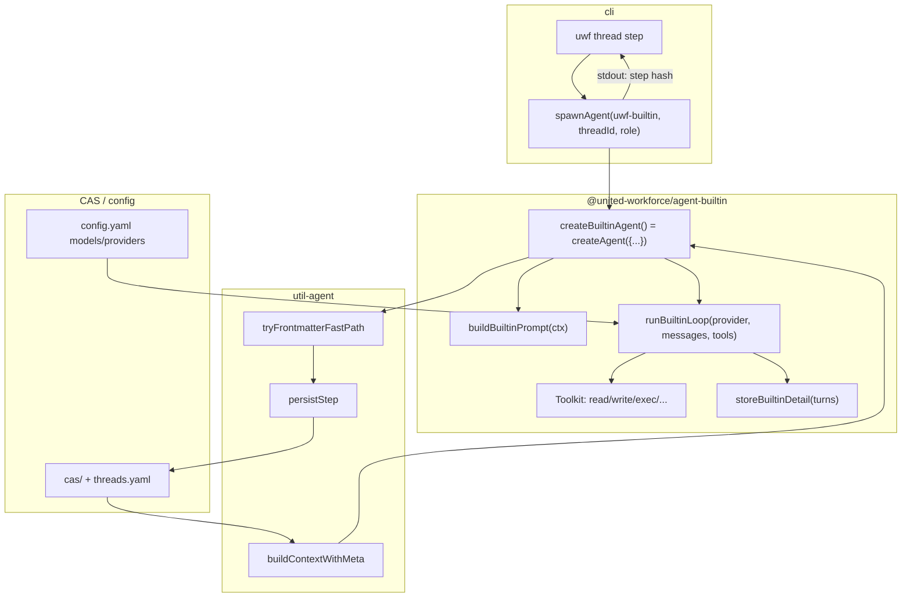

# Built-in Role Agent 调研

## 目标

实现一个内置的 role agent（暂称 `uwf-builtin`），不依赖 hermes/openclaw 等外部 agent 进程。
直接使用 workflow config 中配置的 model，自己实现 agent run loop 和关键 toolkit。

---

## 关键问题

### Q1: Agent 接口协议

现有 agent 是怎么被 CLI 调用的？输入（argv、环境变量）和输出（stdout、CAS）格式是什么？

**调研要点：**
- `cli` 里 `spawnAgent` 的完整实现
- AgentConfig 类型定义
- agent 进程的 exit code 约定
- 环境变量传递（UWF_STORAGE_ROOT 等）

**答案：**

#### 调用链

`uwf thread step` → `cmdThreadStepOnce` → moderator 求值下一 role → `resolveAgentConfig` → `spawnAgent`。

#### AgentConfig 类型

```146:149:packages/protocol/src/types.ts
export type AgentConfig = {
  command: string;
  args: string[];
};
```

在 `config.yaml` 的 `agents` 段注册，例如 `hermes: { command: "uwf-hermes", args: [] }`。

#### spawnAgent 行为

```627:653:packages/cli/src/commands/thread.ts
function spawnAgent(agent: AgentConfig, threadId: ThreadId, role: string): CasRef {
  const argv = [...agent.args, threadId, role];
  let stdout: string;
  try {
    stdout = execFileSync(agent.command, argv, {
      encoding: "utf8",
      env: process.env,
      stdio: ["ignore", "pipe", "pipe"],
    });
  } catch (e) {
  // ... stderr 拼进 fail 消息
  }

  const line = stdout.trim().split("\n").pop()?.trim() ?? "";
  if (!isCasRef(line)) {
    fail(`agent stdout is not a valid CAS hash: ${line || "(empty)"}`);
  }
  return line;
}
```

| 项目 | 约定 |
|------|------|
| **argv** | `[...agent.args, <thread-id>, <role>]`，即 `process.argv[2]`=threadId，`process.argv[3]`=role（与 `createAgent` 的 `parseArgv` 一致） |
| **stdin** | 忽略 |
| **stdout** | 纯文本，**最后一行**必须是新 `StepNode` 的 CAS hash（13 字符 Crockford Base32） |
| **stderr** | 失败时 CLI 会附带 stderr；成功时无约定 |
| **exit code** | `0` = 成功；非 0 时 `execFileSync` 抛错，step 失败 |
| **环境变量** | 继承父进程 `process.env`（含 storage root、API key 等） |
| **链头更新** | **不由 agent 负责**；agent 只写 CAS StepNode，CLI 在拿到 stdout hash 后更新 `threads.yaml` |

Agent 解析优先级（`resolveAgentConfig`）：

1. CLI `--agent` override（整段 command + args 字符串）
2. `config.agentOverrides[workflow.name][role]`
3. `config.defaultAgent`

#### 环境变量：Storage Root

文档中写的 `UWF_STORAGE_ROOT` **在当前代码中不存在**。实际优先级（`util-agent` / `cli` 一致）：

```33:43:packages/util-agent/src/storage.ts
export function resolveStorageRoot(): string {
  const internal = process.env.UWF_STORAGE_ROOT;
  if (internal !== undefined && internal !== "") {
    return internal;
  }
  const userOverride = process.env.WORKFLOW_STORAGE_ROOT;
  if (userOverride !== undefined && userOverride !== "") {
    return userOverride;
  }
  return getDefaultStorageRoot();
}
```

Agent 子进程通过继承的 `process.env` 与父 CLI 共享同一 storage root；`createAgent` 内还会 `loadDotenv({ path: getEnvPath(storageRoot) })` 加载 `~/.uwf/.env`。

#### Agent 侧职责（设计文档 + 实现）

- 读 `threads.yaml` 链头，构建 context，执行 role
- 将 `StepNode` 写入 CAS（`output` / `detail` / `agent` / `prev` / `start`）
- stdout 打印 step hash
- **不**更新 `threads.yaml`

---

### Q2: createAgent 工厂

util-agent 的 `createAgent` 做了什么？它的完整生命周期是什么？

**调研要点：**
- `AgentOptions` 类型的 `run` 和 `continue` 回调签名
- `AgentRunResult` 的完整定义
- retry 逻辑（frontmatter 校验失败后的重试机制）
- `persistStep` 写入 CAS 的 StepNode 结构

**答案：**

#### 类型定义

```4:35:packages/util-agent/src/types.ts
export type AgentContext = ModeratorContext & {
  threadId: ThreadId;
  role: string;
  store: Store;
  workflow: WorkflowPayload;
  outputFormatInstruction: string;
};

export type AgentRunResult = {
  output: string;
  detailHash: CasRef;
  sessionId: string;
};

export type AgentContinueFn = (
  sessionId: string,
  message: string,
  store: AgentContext["store"],
) => Promise<AgentRunResult>;

export type AgentRunFn = (ctx: AgentContext) => Promise<AgentRunResult>;

export type AgentOptions = {
  name: string;
  run: AgentRunFn;
  continue: AgentContinueFn;
};
```

- **`run(ctx)`**：首次执行，返回原始 agent 文本 `output`、审计用 `detailHash`、用于续聊的 `sessionId`。
- **`continue(sessionId, message, store)`**：在同一 session 上追加用户消息（用于 frontmatter 纠错），再次返回 `AgentRunResult`。

`createAgent(options)` 返回 `() => Promise<void>`，作为 agent CLI 的 `main`（见 `uwf-hermes` 的 `cli.ts`）。

#### 生命周期（按执行顺序）

```101:152:packages/util-agent/src/run.ts
export function createAgent(options: AgentOptions): () => Promise<void> {
  return async function main(): Promise<void> {
    const { threadId, role } = parseArgv(process.argv);
    const storageRoot = resolveStorageRoot();
    loadDotenv({ path: getEnvPath(storageRoot) });

    const ctx = await buildContextWithMeta(threadId, role);
    // 1. 校验 role 存在
    // 2. 从 CAS 取 frontmatter JSON Schema → buildOutputFormatInstruction → ctx.outputFormatInstruction

    let agentResult = await options.run(ctx);

    let outputHash = await tryExtractOutput(agentResult.output, roleDef.frontmatter, ctx);

    for (let retry = 0; retry < MAX_FRONTMATTER_RETRIES && outputHash === null; retry++) {
      const correctionMessage = "Your previous response did not contain valid YAML frontmatter...";
      agentResult = await options.continue(agentResult.sessionId, correctionMessage, ctx.meta.store);
      outputHash = await tryExtractOutput(agentResult.output, roleDef.frontmatter, ctx);
    }

    if (outputHash === null) { fail(...); }

    const stepHash = await persistStep({ ctx, outputHash, detailHash: agentResult.detailHash, agentName });
    process.stdout.write(`${stepHash}\n`);
  };
}
```

| 阶段 | 行为 |
|------|------|
| 解析 argv | `argv[2]=threadId`, `argv[3]=role`，缺失则 `stderr` + `exit(1)` |
| Context | `buildContextWithMeta` + 可选 `outputFormatInstruction` |
| Run | `options.run(ctx)` |
| Extract | **仅** `tryFrontmatterFastPath`（见 Q4）；**不**调用 `extract()` LLM fallback |
| Retry | 最多 `MAX_FRONTMATTER_RETRIES = 2` 次 `continue` + 再试 fast-path |
| Persist | `persistStep` → `writeStepNode` |
| 输出 | stdout 一行 step CAS hash |

#### StepNode 写入结构

```44:68:packages/util-agent/src/run.ts
async function writeStepNode(options: {
  store: AgentStore["store"];
  schemas: AgentStore["schemas"];
  startHash: CasRef;
  prevHash: CasRef | null;
  role: string;
  outputHash: CasRef;
  detailHash: CasRef;
  agentName: string;
}): Promise<CasRef> {
  const payload: StepNodePayload = {
    start: options.startHash,
    prev: options.prevHash,
    role: options.role,
    output: options.outputHash,
    detail: options.detailHash,
    agent: options.agentName,
  };
  // store.put(stepNode schema) + validate
}
```

`agentName` 经 `agentLabel(name)` 规范化：已有 `uwf-` 前缀则原样，否则加 `uwf-`（如 `hermes` → `uwf-hermes`）。

`prevHash`：若链头仍是 `StartNode` 则为 `null`，否则为当前 head step hash。

---

### Q3: Context Builder

`buildContextWithMeta` 构建了什么上下文给 agent？

**调研要点：**
- `AgentContext` 完整类型定义（所有字段）
- context 构建过程（CAS chain walk）
- `outputFormatInstruction` 怎么生成的
- role definition 怎么获取（从 workflow YAML）

**答案：**

#### AgentContext 字段

继承 `ModeratorContext`：

```60:68:packages/protocol/src/types.ts
export type ModeratorContext = {
  start: StartNodePayload;
  steps: StepContext[];
};
```

```48:51:packages/protocol/src/types.ts
export type StartNodePayload = {
  workflow: CasRef;
  prompt: string;
};
```

```61:63:packages/protocol/src/types.ts
export type StepContext = Omit<StepRecord, "output"> & {
  output: unknown;
};
```

`AgentContext` 额外字段：

| 字段 | 类型 | 含义 |
|------|------|------|
| `threadId` | `ThreadId` | 当前线程 |
| `role` | `string` | 本步要执行的角色名 |
| `store` | `Store` | CAS store（读写节点） |
| `workflow` | `WorkflowPayload` | 已从 CAS 加载的 workflow 定义 |
| `outputFormatInstruction` | `string` | 由 `createAgent` 根据 role 的 frontmatter schema 生成；`buildContext*` 初始为 `""` |

`buildContextWithMeta` 还返回 `meta`：

```148:154:packages/util-agent/src/context.ts
export type BuildContextMeta = {
  storageRoot: string;
  store: Store;
  schemas: AgentStore["schemas"];
  headHash: CasRef;
  chain: ChainState;
};
```

#### CAS chain walk

1. 从 `threads.yaml[threadId]` 取 `headHash`
2. `walkChain`：若 head 是 `StartNode`，`stepsNewestFirst=[]`；否则沿 `prev` 收集所有 `StepNode`， newest-first
3. `buildHistory`：反转为时间序，`expandOutput` 把每步 `output` CasRef 展开为 JSON payload（供 prompt / moderator 使用）
4. `loadWorkflow`：从 `start.workflow` CasRef 加载 `WorkflowPayload`

#### Role definition 来源

- 作者写在 workflow YAML 的 `roles.<name>`（`goal`, `capabilities`, `procedure`, `output`, `frontmatter` 等）
- `uwf workflow put` 时 `frontmatter` 内联 JSON Schema 经 `putSchema` 存入 CAS，workflow 里存的是 **CasRef**
- Agent 运行时：`ctx.workflow.roles[ctx.role]` → `RoleDefinition`

#### outputFormatInstruction

在 `createAgent` 中，若 `getSchema(store, roleDef.frontmatter)` 非空，则：

```typescript
ctx.outputFormatInstruction = buildOutputFormatInstruction(frontmatterSchema);
```

`buildOutputFormatInstruction` 根据 JSON Schema 的 `properties` 生成「必须以 `---` YAML frontmatter 开头」的说明和示例字段列表（见 `build-output-format-instruction.ts`）。

各 agent 实现（Hermes / Claude Code）在组装 prompt 时把该块放在最前，再接 `buildRolePrompt(roleDef)`。

---

### Q4: Extract Pipeline

agent 输出怎么被处理成结构化数据？

**调研要点：**
- frontmatter fast-path 的完整逻辑
- LLM extract fallback 的实现（`extract.ts`）
- frontmatter schema 从哪里来（role 定义里的 `frontmatter` 字段）
- 校验失败时的 correction prompt 是什么

**答案：**

#### Schema 来源

Workflow YAML 中每个 role 的 `frontmatter:` 段是 JSON Schema 对象；注册时：

```66:76:packages/cli/src/commands/workflow.ts
async function resolveFrontmatterRef(..., frontmatter: unknown): Promise<CasRef> {
  // 校验为 JSON Schema → putSchema → 返回 CasRef
}
```

运行时 `roleDef.frontmatter` 即该 schema 的 CAS hash；structured `output` 节点用**同一 schema** 写入 CAS。

#### Frontmatter fast-path（createAgent 实际使用的路径）

```148:195:packages/util-agent/src/frontmatter.ts
export async function tryFrontmatterFastPath(
  raw: string,
  outputSchema: CasRef,
  store: Store,
): Promise<FrontmatterFastPathResult | null>
```

流程：

1. `parseFrontmatterMarkdown(raw)` → 标准 agent 字段（`status`, `next`, `confidence`, `artifacts`, `scope`）+ body
2. `validateFrontmatter` 失败 → `null`
3. `getSchema(store, outputSchema)` + `extractSchemaFields` 得到 role 需要的属性名
4. `buildCandidate`：从标准 frontmatter + YAML 原始字段拼出符合 schema 的对象
5. `store.put(outputSchema, candidate)` + `validate` → 成功则 `{ body, outputHash }`

**永不抛错**，失败返回 `null`。

#### LLM extract fallback（已实现但未接入 createAgent）

```135:181:packages/util-agent/src/extract.ts
export async function extract(
  rawOutput: string,
  outputSchema: CasRef,
  config: WorkflowConfig,
): Promise<ExtractResult>
```

- 模型：`resolveExtractModelAlias(config)` → `modelOverrides.extract` → `models.extract` → `models.default` → `defaultModel`
- HTTP：`POST {baseUrl}/chat/completions`，`response_format: { type: "json_object" }`
- System：要求按 JSON Schema 从 agent 输出提取单个 JSON 对象
- 校验通过后 `store.put(outputSchema, structured)`

**重要：`createAgent` 当前未调用 `extract()`**。fast-path 失败且 2 次 `continue` 仍失败则直接 `fail()`。builtin agent 若希望无 frontmatter 也能跑，需在 kit 或 builtin 层显式接入 `extract()`。

#### Correction prompt（retry）

```125:128:packages/util-agent/src/run.ts
const correctionMessage =
  "Your previous response did not contain valid YAML frontmatter matching the role schema.\n" +
  "You MUST begin your response with a YAML frontmatter block (--- delimited).\n" +
  "Please output ONLY the corrected frontmatter block followed by your work.";
```

通过 `options.continue(sessionId, correctionMessage, store)` 发给外部 agent；builtin 需在自有 message 历史里 append 同等语义的 user 消息。

---

### Q5: Model 配置与 LLM 调用

workflow 怎么配置和使用 model？

**调研要点：**
- `WorkflowConfig` 中 providers/models/defaultModel/modelOverrides 的完整定义
- `resolveModel` 函数的实现
- `chatCompletionText` 的实现（OpenAI 兼容 HTTP 客户端）
- 有没有 streaming 支持？tool calling 支持？

**答案：**

#### WorkflowConfig

```136:160:packages/protocol/src/types.ts
export type ProviderConfig = {
  baseUrl: string;
  apiKey: string;
};

export type ModelConfig = {
  provider: ProviderAlias;
  name: string;
};

export type WorkflowConfig = {
  providers: Record<ProviderAlias, ProviderConfig>;
  models: Record<ModelAlias, ModelConfig>;
  agents: Record<AgentAlias, AgentConfig>;
  defaultAgent: AgentAlias;
  agentOverrides: Record<WorkflowName, Record<RoleName, AgentAlias>> | null;
  defaultModel: ModelAlias;
  modelOverrides: Record<Scenario, ModelAlias> | null;
};
```

示例见 `docs/architecture.md`（`providers` / `models` / `defaultModel` / `modelOverrides.extract`）。

#### resolveModel

```32:50:packages/util-agent/src/extract.ts
export function resolveModel(config: WorkflowConfig, alias: ModelAlias): ResolvedLlmProvider {
  const modelEntry = config.models[alias];
  const providerEntry = config.providers[modelEntry.provider];
  const apiKey = providerEntry.apiKey;
  return { baseUrl: providerEntry.baseUrl, apiKey, model: modelEntry.name };
}
```

`ResolvedLlmProvider = { baseUrl, apiKey, model }`。

Extract 专用别名解析：

```18:30:packages/util-agent/src/extract.ts
export function resolveExtractModelAlias(config: WorkflowConfig): ModelAlias {
  return config.modelOverrides?.extract ?? (config.models.extract ? "extract" : config.models.default ? "default" : config.defaultModel);
}
```

**尚无** `modelOverrides` 按 role/workflow 解析 agent 主模型的函数；builtin 首版可用 `config.defaultModel`，扩展时可加 `modelOverrides.agent` 或与 `agentOverrides` 对称的表。

#### chatCompletionText

```87:124:packages/util-agent/src/extract.ts
async function chatCompletionText(
  provider: ResolvedLlmProvider,
  messages: Array<{ role: "system" | "user"; content: string }>,
): Promise<string>
```

| 能力 | 现状 |
|------|------|
| 协议 | OpenAI 兼容 `POST /chat/completions` |
| Streaming | **无**（一次性 `response.text()`） |
| Tool calling | **无**（无 `tools` / `tool_calls` 字段） |
| 多模态 | **无**（仅 text `content`） |
| Extract 专用 | `response_format: { type: "json_object" }` |

builtin agent 的 run loop 需要**新写**带 `tools` 的 completion 客户端（可放在 `agent-builtin` 或扩展 `util-agent` 的 `llm/` 模块），不能复用当前 `chatCompletionText` 而不改。

---

### Q6: Hermes Agent 参考实现

`uwf-hermes` 是怎么实现 `run` 和 `continue` 的？

**调研要点：**
- prompt 怎么组装的（outputFormatInstruction + rolePrompt + task + history）
- hermes CLI 的调用参数
- session management（resume）
- 输出怎么捕获

**答案：**

#### Prompt 组装

```40:53:packages/agent-hermes/src/hermes.ts
export function buildHermesPrompt(ctx: AgentContext): string {
  const roleDef = ctx.workflow.roles[ctx.role];
  const rolePrompt = roleDef !== undefined ? buildRolePrompt(roleDef) : "";
  const parts: string[] = [];
  if (ctx.outputFormatInstruction !== "") {
    parts.push(ctx.outputFormatInstruction, "");
  }
  parts.push(rolePrompt, "", "## Task", ctx.start.prompt);
  const historyBlock = buildHistorySummary(ctx.steps);
  if (historyBlock !== "") {
    parts.push("", historyBlock);
  }
  return parts.join("\n");
}
```

`buildRolePrompt` 生成 `## Goal` / `## Capabilities` / `## Prepare`（含 `generateCliReference()`）/ `## Procedure` / `## Output`。

`buildHistorySummary`：每步 `role`、`JSON.stringify(step.output)`、`agent`。

Hermes 把**整段 prompt 作为单条 user 消息**传给 `hermes chat -q`（无独立 system channel）。

#### Hermes CLI 参数

首次：

```88:97:packages/agent-hermes/src/hermes.ts
spawnHermes(["chat", "-q", prompt, "--yolo", "--max-turns", "90", "--quiet"]);
```

续聊：

```100:114:packages/agent-hermes/src/hermes.ts
spawnHermes(["chat", "--resume", sessionId, "-q", message, "--yolo", "--max-turns", "90", "--quiet"]);
```

#### Session

- stdout/stderr 中解析 `session_id: <id>`（`parseSessionIdFromStdout`）
- 会话文件：`~/.hermes/sessions/session_<id>.json`
- `loadHermesSession` → `storeHermesSessionDetail`：每 assistant/tool 消息写成 CAS turn 节点，汇总为 `detail`；**output 文本** = 最后一条非空 `assistant` 的 `content`

#### 与 createAgent 的衔接

```157:164:packages/agent-hermes/src/hermes.ts
export function createHermesAgent(): () => Promise<void> {
  return createAgent({ name: "hermes", run: runHermes, continue: continueHermes });
}
```

`uwf-hermes` 入口：`createHermesAgent()` 即 main。

Claude Code 包（`agent-claude-code`）结构相同：`buildClaudeCodePrompt` 同构，`claude -p` + `--resume` + JSON stdout 解析。

---

### Q7: Toolkit 需求分析

要实现一个自给自足的 agent，最少需要哪些 tool？

**调研要点：**
- 现有 workflow example（solve-issue.yaml）里 role 都做什么任务
- hermes agent 在 workflow 场景下常用哪些 tool
- 哪些 tool 是 agent loop 必须的（如 file read/write、shell exec、web fetch）

**答案：**

#### solve-issue.yaml 角色能力

| Role | capabilities | 隐含需求 |
|------|----------------|----------|
| planner | issue-analysis, planning | 读上下文/仓库、总结，通常不需写代码 |
| developer | file-edit, shell, testing | **读文件、写文件、执行命令** |
| reviewer | code-review, static-analysis | 读 diff/文件、静态分析（可读+可选 shell） |

#### Hermes 侧

Hermes 自带完整 agent runtime（`--yolo`、max-turns），tool 集由 Hermes 项目定义，workflow 不配置。从 session JSON 可见 `tool_calls` 被记入 detail，常见包括文件与 shell 类工具。

#### Builtin 最小 toolkit 建议

| 优先级 | Tool | 用途 |
|--------|------|------|
| P0 | `read_file` | 读仓库/配置/issue 上下文 |
| P0 | `write_file` / `edit_file` | developer 改代码 |
| P0 | `run_command` | 测试、构建、git（需 cwd + timeout + 输出截断） |
| P1 | `list_dir` / `glob` | 导航代码库 |
| P1 | `grep` | 搜索符号/引用 |
| P2 | `fetch_url` | 查文档（planner 偶尔需要） |

**不需要**在 builtin 里实现 moderator / workflow 路由工具——仍由 `uwf thread step` + status-based moderator 负责。

#### Agent loop 必须能力

1. 多轮 LLM 调用 + **OpenAI-style tool_calls** 解析与执行
2. 将 tool 结果 append 回 messages
3. 终止条件：模型不再请求 tool，或达到 `maxTurns`
4. 最终响应须含合法 YAML frontmatter（满足 Q4），供 `createAgent` fast-path

---

## 方案草案

（调研完成后基于以上答案撰写）

### 架构设计



**新包**：`packages/agent-builtin`，bin `uwf-builtin`，仅依赖 `util-agent`、`protocol`、`util`（可选 `@ocas/core` 写 detail schema）。

**分层**：

| 层 | 职责 |
|----|------|
| `createAgent`（kit） | argv、context、frontmatter extract、StepNode、stdout 协议 — **不变** |
| `builtin/agent.ts` | `run` / `continue` 实现 |
| `builtin/llm.ts` | OpenAI 兼容 chat + tools（可后续抽到 kit） |
| `builtin/tools/*.ts` | 各 tool 的 JSON Schema + handler |
| `builtin/prompt.ts` | 复用 Hermes 的 prompt 拼接逻辑（或抽到 kit 的 `buildAgentPrompt`） |
| `builtin/detail.ts` | 类似 Hermes：每轮 assistant/tool 写入 CAS detail |

**配置集成**：

```yaml
agents:
  builtin:
    command: "uwf-builtin"
    args: []
defaultAgent: "builtin"   # 或 agentOverrides 按 role 指定
```

模型：首版 `resolveModel(config, config.defaultModel)`；后续可增加 `modelOverrides.agent` 或 per-role 映射。

---

### Agent Run Loop

伪代码（单次 `run(ctx)`）：

```
1. provider ← resolveModel(loadWorkflowConfig(), defaultModel)
2. system ← buildBuiltinPrompt(ctx)   // outputFormatInstruction + buildRolePrompt + Task + History
3. messages ← [{ role: "system", content: system }]
4. sessionId ← newULID()              // 内存或临时目录，供 continue 使用
5. turns ← []

6. for turn in 1..MAX_TURNS:
     response ← chatCompletionWithTools(provider, messages, TOOL_DEFINITIONS)
     record assistant message + tool_calls in turns

     if response has no tool_calls:
       finalText ← response.content
       break

     for each tool_call:
       result ← executeTool(tool_call, { cwd: process.cwd() })
       messages.push tool result
       record in turns

7. if no finalText with valid frontmatter after loop:
     optionally one-shot "finalize" message without tools

8. detailHash ← storeBuiltinDetail(store, sessionId, turns, metadata)
9. return { output: finalText, detailHash, sessionId }
```

**`continue(sessionId, message, store)`**：

- 从内存/磁盘恢复 `messages` + `turns`
- `messages.push({ role: "user", content: message })`（correction 或续聊）
- 从步骤 6 继续，步数上限可单独设小一点（如 3）
- 返回新的 `AgentRunResult`

**与 frontmatter 的配合**：

- system prompt 已含 `outputFormatInstruction`；最后一轮可强制 user：`Now output your final answer with YAML frontmatter only if you have not yet.`
- 仍依赖 `createAgent` 的 fast-path + 最多 2 次 continue

**安全**：

- `run_command`：白名单或需 `UWF_BUILTIN_ALLOW_SHELL=1`，默认工作区限定在 `process.cwd()` 或 `start` 中将来扩展的 `workspace` 字段
- 路径：禁止 `..` 逃逸出 workspace root

---

### Toolkit 设计

统一注册表：

```typescript
type BuiltinTool = {
  name: string;
  description: string;
  parameters: JSONSchema; // object type
  execute: (args: unknown, ctx: ToolContext) => Promise<string>;
};

type ToolContext = {
  cwd: string;
  storageRoot: string;
};
```

| Tool name | OpenAI function | 行为摘要 |
|-----------|-----------------|----------|
| `read_file` | `read_file` | `{ path }` → UTF-8 文本，大小上限 |
| `write_file` | `write_file` | `{ path, content }` → 写盘，返回确认 |
| `edit_file` | 可选 | search/replace 块，减少 token |
| `run_command` | `run_command` | `{ command, cwd? }` → stdout/stderr 截断 |
| `list_dir` | `list_dir` | `{ path }` → 条目列表 |
| `grep` | `grep` | `{ pattern, path? }` → 匹配行 |

**LLM 请求形状**（扩展 extract 客户端）：

```json
{
  "model": "...",
  "messages": [...],
  "tools": [{ "type": "function", "function": { "name", "description", "parameters" } }],
  "tool_choice": "auto"
}
```

解析 `choices[0].message.tool_calls`，执行后以 `{ role: "tool", tool_call_id, content }` 回传。

**不提供** streaming 首版；detail CAS 记录每轮 tool 名/参数/结果摘要供 `uwf thread step-details` 调试。

---

### 与现有架构的集成

| 集成点 | 方式 |
|--------|------|
| CLI 协议 | 实现标准 agent CLI：`uwf-builtin <thread-id> <role>`，stdout 一行 step hash，exit 0/1 |
| 工厂 | `export function createBuiltinAgent()` → `createAgent({ name: "builtin", run, continue })` |
| Context / Prompt | 复用 `buildContextWithMeta`、`buildRolePrompt`、`buildOutputFormatInstruction`；prompt 布局对齐 `buildHermesPrompt` |
| 结构化输出 | 优先 YAML frontmatter fast-path；可选后续在 `createAgent` 增加 `extract()` fallback 开关 |
| 配置 | `config.yaml` 增加 `agents.builtin`；`uwf setup` 可选默认 agent |
| 存储 | `resolveStorageRoot()` + `loadWorkflowConfig` + `getEnvPath`；与 Hermes 相同，**不**改 `threads.yaml` 写入方 |
| 测试 | 单元测试：tool handlers、prompt 组装、mock LLM tool loop；集成测试：临时 storage root + fake provider |
| 发布 | 新包 `@united-workforce/agent-builtin`，bin `uwf-builtin`，加入 `scripts/publish-all.mjs` |

**明确不做**：

- 不替代 moderator / 不在 agent 内调用 `uwf thread step`
- 不依赖 Hermes/OpenClaw/Claude Code 二进制
- 首版不实现 streaming、不实现 MCP

**建议实现顺序**：

1. `llm.ts`：tool calling HTTP 客户端 + 单测
2. P0 tools + `runBuiltinLoop`
3. `createBuiltinAgent` + detail CAS
4. `config` / docs / `examples` 可选 `agentOverrides` 演示
5. （可选）`createAgent` 接入 `extract()` fallback
